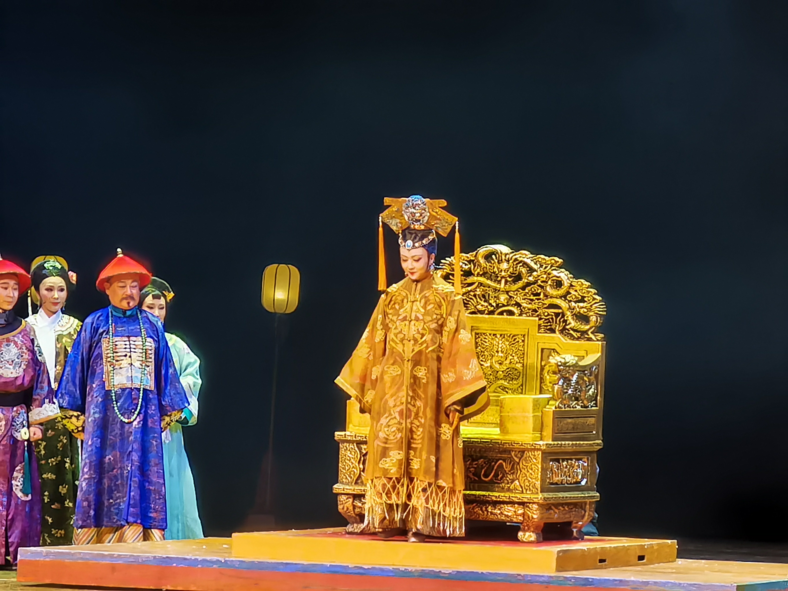
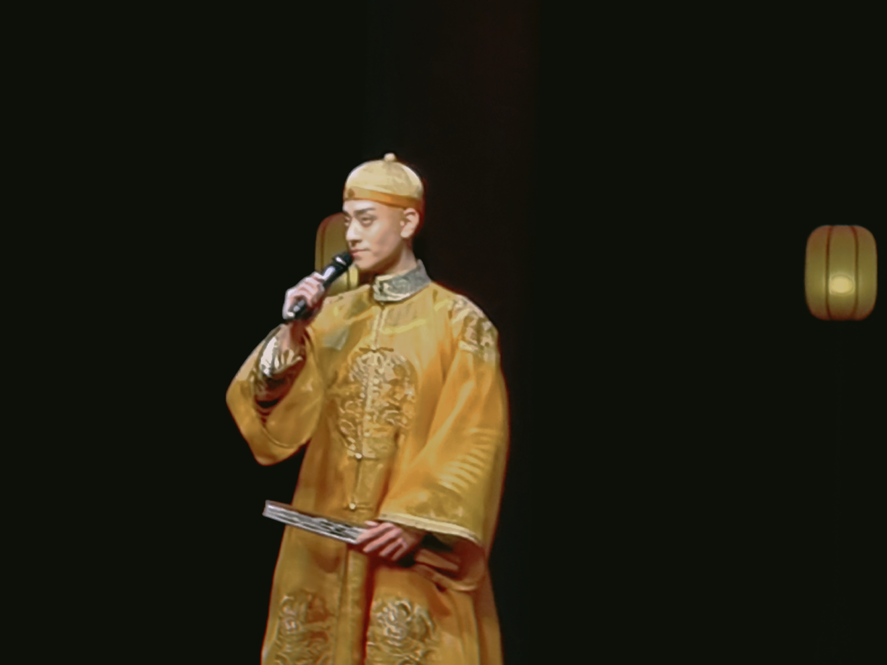
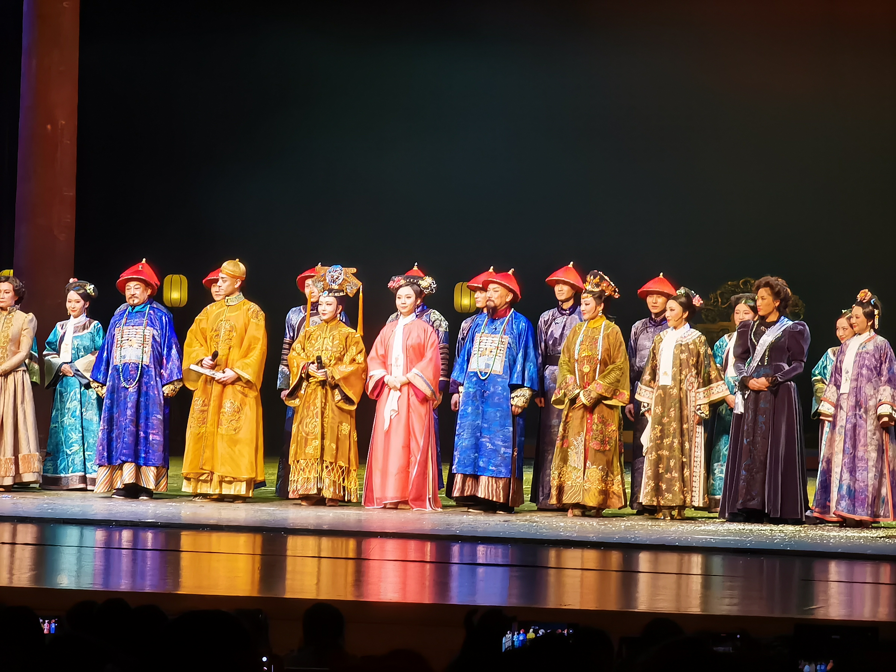

不得不说，作为一部二十年来多次复排、获奖无数的经典剧目，《德龄与慈禧》剧本本身是经得住考验的，叙事节奏掌握得恰到好处，笑点和情感爆发点兼有。更重要的是，人物是值得推敲的。

#### \- 关于慈禧 -

一开始我并不理解慈禧为什么这么喜欢德龄。在我印象中，慈禧就是那个国难当头可以说出“今日令吾不欢者，吾亦将令彼终身不欢”这种话的固执的老太太，将大清视为世界的中心，鄙夷一切外来事物。而德龄是一个在国外长大的女孩子，第一次进宫时的行为举止与封建礼法完全相悖；后来与慈禧相处的时候，经常冒出的“不合时宜”的言语也不禁让人担心她下一秒的境遇。

但后来我有点明白了。一方面，德龄本身是讨人喜欢的，她聪明、懂得如何处事，这从她与俄国公使夫人的对决就可看出（这段也是绝了，做翻译的戏份还有中英双语的台词，而不是像某些电视剧那样把中文翻译成中文【辣菜.jpg】）。更重要的，另一方面，慈禧不是书本中扁平的名字。她是一个人。

她是一个人，有思维有情感的人。她确实是像史书中记载的那样傲慢记仇、贪慕虚荣，但她也有对新东西的好奇和向往，对可爱人事物的欣赏，还有与心上人的爱情。可她在这个牢笼里呆了几十年了，人总是倾向于偏安一隅的。她并非不知道这个国家面临着什么，也不是不知道改革是必走之路。但她不免有些疑虑要如何走，走这一步的后果是什么。

德龄带来的奇特感有些撼动了她种种情感保持多年的平衡。她被告知，她是可以坦坦荡荡地去表达自己的爱的。当内心的想法被击中的时候，或许人会对知音产生偏爱之情。而爱人荣禄的死讯让她下定决心接受改变，可惜的是，此时大清江山和她本人的气数，已经所剩无几了。

（慈禧和荣禄的这段故事让我大吃一惊，是看到他俩有感情线的那一刻忍不住说了一句“啊这”的程度。不过文学创作参考野史也是情有可原。最后荣禄跪在雪地里宣读遗书的那个画面冲击感真的好强，周围一片黑暗，只有冷白色的场光打在他身上，深蓝色的朝服隐隐泛着光，空中飘着雪花……）

#### \- 关于光绪 -

一声“万岁爷驾到”全场观众不约而同都支棱了起来。和第一轮相比，龙瘦得可怜，微凹的脸庞上挂着一对悲怆的眼睛，除了和德龄学英文的一幕，几乎没有笑的时候。随着剧情的发展，光绪的精气神耗尽了，腰背也渐渐弓得越来越厉害。

印象最深刻的两场戏。一是与皇后的对峙，光绪第一次向禁锢自己的世界里的人坦露了自己的心声——你不是人，我不喜欢你，我不喜欢这一切。但是皇后却牛头不对马嘴，尽说些合乎礼法却听起来阴阳怪气的话。好吧，我以后再也不要跟你说话了！不过在这里，光绪虽然失望、愤怒，情感上仍是有所克制的。而递变法奏折是唯一的一次情绪爆发。他在那一刻鼓起勇气要反抗面前这个专权多年的皇太后、他名义上的母亲，振振有词地力陈变革之利。但是慈禧一怒，他马上又退缩了。没有办法，他再想做些什么，终究是敌不过这已存在千年的枷锁。

#### \- 关于皇后 -

皇后真是一个有意思的存在。她也曾是个天真的少女，但因为“祖宗家法”到了这个地步。可悲的是，如今的她口口声声“祖宗家法”说得比谁都更理直气壮，甚至是慈禧都还没发声，她自动地就去做了。是吧，“太后之后皇后便是太后”，她终究是甘愿成为了“祖宗家法”的发号施令者。（以至于最后慈禧病重卧床【实际上是人偶】，幕前突然走出来一个穿着太后服饰的人【慈禧】，我没看清脸甚至以为这句话灵验了……）

#### \- 其他碎碎念 -

不得不说江珊老师对角色的把握非常到位，喜怒哀乐通过小小的语气改变或者动作就能准确反映出来，让人听了只想跪下喊老祖宗。

话剧老演员的台词真的是降维打击，听起来很自然，没有那种戏剧腔，却不失戏剧性。

郎玲姐姐的腔调似乎在故意往歪国人上靠，（后来听说是在模仿原卡？）很有意思。

舞台很漂亮。灯光的主色调是暗暗的、冷冷的，像烛光的效果。服装的色彩算比较鲜艳，两者组合起来，给人时间上疏离的感觉，人物却是鲜活的。

宫中传话的时候在舞台（甚至后台？）重复了三四遍，刻画了深宫的空间感。

#### \- 粉丝言论 -

谢幕是光绪，但返场是龙，仔细地用眼睛记住观众席每一个角落，不时露出一些可可爱爱嘚嘚瑟瑟的小表情。幸运的是这是南京首场，返场福利《曙色》，虽然看的是话剧但有幸蹭到了唱歌龙，呜呜，太稳了。

P.S.：慈禧和光绪没出场的时候，德龄和容龄说他们可能不是猛兽而是猫，还喵~了一声，就很符合（滑稽）

 