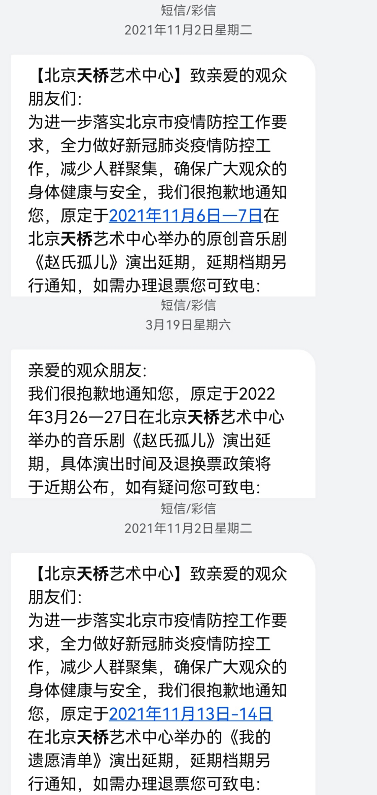

## 
I

现在是2022年3月27日22:45。此刻我本应在天桥艺术中心大剧场，观看音乐剧《赵氏孤儿》因去年北京疫情而延期的第一轮巡演的大末场，按照计划演出应该刚刚结束。然而，上周收到短信通知，由于最近的疫情，本次演出再次延期。这距离开票已经过去十个月了。

###### 
赵孤两次延期，附带被退票的遗愿清单……（幸好中罗朱没取消

去年今日，疫情稍稍平稳，我冒险前往南京观看《德龄与慈禧》。因为担心有变数，我没来得及在这个我从未到访过的美丽的城市游览几个景点，便在第二天一早匆匆赶回北京。（事实证明这次冒险是正确的，因为在此之后的北京场也因为疫情被取消了…………）

本来觉得，疫情控制只会越来越好，谁能想到在新冠病毒出现已经两年的今天，还会存在买了票十个月还看不上剧，且不知道什么时候才能看上的事情呢？

## 
II

2022年开端，网上流传着一张地狱笑话meme：

###### 
这TM也太魔鬼了吧

不知道是巧合还是命中注定，2022年的疫情形势与2020相比实在是大哥莫笑二哥。新的变种不断出现，传播能力越来越强，还（终究）把魔爪伸入中国大陆的校园。或许一觉醒来，就发现自己与确诊病例有时空交集。疫情影响的不是一两场演出这么简单。一些城市客观上已经停摆了，在维持经济、秩序和控制疫情传播之间进退两难，人们失去经济来源，失去外出的自由，失去健康，甚至失去生命。

新冠以外，最近许多不幸的事情涌入人们的视野。可怕的战争，令人绝望的出行意外，沾满恶的蓄意犯罪……“祸不单行”或许有一定道理，世界仿佛总在发生一些不好的事情，人太渺小了，即便有心，也根本无力与宏观的悲剧对抗。

与此同时，个人微观的不顺也不断搞乱心态。前段时间，在电动车又一次在路上提前没电之后，我发了一条满篇都是问句的牢骚：“人为什么要住万柳？……（此处省略一万字）……日内瓦，退钱！”不过，促使我发出质问的原因不止身体、出行和科研状况不好。某天深夜开完会，走到最美时光的门口，路上只有匆忙赶路的我，和并肩慢慢压着马路的几对小情侣。黯淡的灯光把他们的身影拉得很长很长。然后我就有点emo了。当然，不是因为独立行走的只有我。以前我晚上回40楼的时候经常走这段路，但近一年我已经很少步行往那边去了。偶尔路过学一门口，会习惯性地往以前房间的阳台看一眼，有时看到那里亮着灯。他们还有日夜在这个园子里生活的时间，我却有些感到不再属于这里。

听闻中关村家乐福已经关店了，食宝街也将紧随其后。疫情之前，我几乎每周都要到那里去。日本拉面、牛杂和真正的青菜、虾三鲜饺子、和朋友们一起吃的杭帮菜台湾菜、在家乐福囤面包和麦片当早餐……有些东西在疫情开始之前已经没有了，有些在20年9月回来消失了，朋友们毕业离开了，现在食宝街也要不在了。

###### 
在食宝街那块拍的一些乱七八糟的东西

上个冬天，我曾祝愿“春暖花开之时再度相见”。但如今春天来了，事情似乎并没有变得更好。所以，这世界还会好吗？

## 
III

人在处境不好的时候，容易怀念过去。听到某些歌，我会想起去年春夏的事情。每周有三四天坐一个小时的班车到南五环学车，再坐一个小时的班车回来；考科目二的那天，天还没亮就起来，早早提心吊胆地考完试，坐在咖啡厅门口开着热点给实验室合作项目讲PPT，然后赶回来上下午一点的歌剧课。尊敬的蔡女士在北京待了三个月，我们一起去奥森看花，一起纠结在北京这个美食荒漠有什么好吃的，一起在书茶、唐宫附近的星巴克和朝阳大悦城写毕业论文。看了《德龄与慈禧》、《空中花园谋杀案》和《白鹿原》。每周日晚上去各种神奇的地方排练合唱或录音。在三角地提着一大堆物资熬大夜排票，只眯了一个小时，六点钟收起帐篷，十二点才开始领票，中间的六个小时几乎要灵魂出窍，领到票匆匆吃了饭跟老板汇报，然后回宿舍叹着空调倒头就睡，直到晚上九点多饿醒……大四下学期的时光多么美好和自由！

但研究表明，人在记忆重构的时候，会受到当下态度的影响。在不好的处境里，为了证明当下确实不好，安慰自己，往往会美化回忆。

想来似乎是这样的。翻看记录，才意识到这段“美好而自由”的时光，事实也不咋地。心理状态很糟糕，身体各种病，科研推导来推导去也没做出来……

如同春天一样，万物竞发、充满希望，但处处都是让人不适的病毒、过敏原，心理疾病也容易发作。

## 
IV

想起有一次排练《无论多少次》，大师给我们阐释作品含义。他说，旅人在路上走着，看到花落风起、欢聚离别、生命来去，视角不断切换，到最后心里产生了一个疑问，他暗暗告诉自己“也许是这样的吧”，但其实并没有一个明确的答案。不管怎样，他也必须继续他的旅途了。

那天，他还说了很多，关于物是人非，关于宏大的世界、身边的人和自己的关系。巧的是那天龙在个音返场唱《玉珍》。然后我回来就开始破防，一直从九点多哭到两点多，到最后已经混乱了，我也不知道我在哭什么。

所以，这世界还会好吗？也许会，也许不吧。谁知道呢？命运的转轮，“年年依然始终如一”。

在确定这篇推送的配乐的时候，考虑了好几首，最终选择了《Jekyll&Hyde》里Lucy最后的独唱《A New Life》（我真的好喜欢Lucy的各种歌）：

> A new world 
> 新世界 
> This one thing I want 
> 在我向你 
> To ask of you, world 
> 告别之前，世界！ 
> Once! - Before it's time 
> 请你给我 
> To say adieu, world! 
> 一次机会，世界！ 
> One sweet chance to 
> 证明那些 
> Prove the cynics wrong! 
> 悲观者有错！ 
> A new life 
> 新生活 
> More and more, I'm sure, 
> 我越来越明白 
> As I go through life, 
> 活着就要 
> Just to play the game, 
> 为人正直， 
> And to pursue life 
> 然后努力生活 
> Just to share its pleasures, 
> 享受当下 
> And belong! 
> 拥抱这人生！ 
> That's what I've been here for, 
> 这是我活下去的 
> All along! 
> 力量！ 
> Each day's 
> 每天都是 
> A brand new life! 
> 新生活！ 

每天都是崭新的一天。继续走吧。

 

###### P.S.：虽然Lucy在唱完《A New Life》之后就领便当了，但此处并没有什么别的意思（

